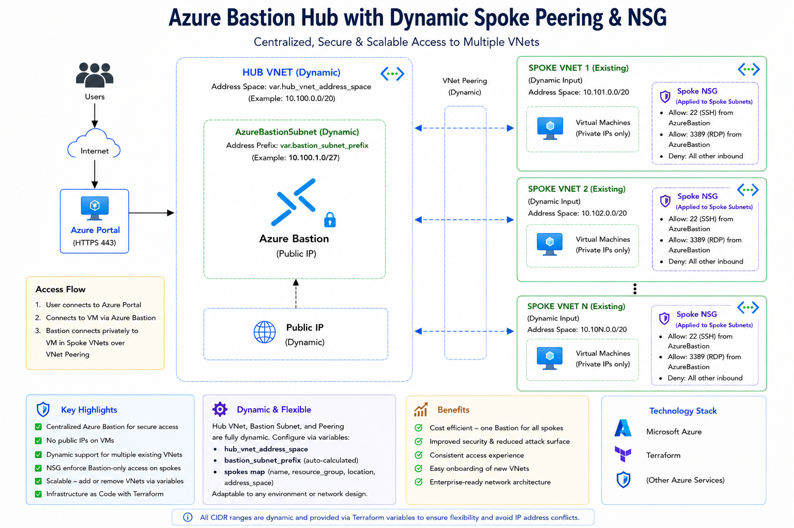

# Azure Bastion with Dynamic VNet Peering (Terraform)

## Overview

This project implements a centralized access architecture in Microsoft Azure using Terraform.

It deploys a centralized Azure Bastion environment and dynamically peers it with multiple **existing VNets (spokes)**.

Spoke VNets and their subnets are defined using a **map of objects**, and Terraform dynamically transforms this structure using a `local.tf` file to enable **per-subnet resource creation**.

The solution enables secure, private access to virtual machines without exposing public IP addresses, while optimizing cost through a single, centralized Bastion deployment.

---

## Architecture



### Bastion Module

* Deploys the centralized Azure Bastion environment
* Acts as the centralized access layer
* Creates:

  * Bastion VNet
  * AzureBastionSubnet
  * Public IP
  * Azure Bastion Host
* Reusable Terraform module

---

### Spoke VNets (Existing)

* Pre-existing VNets in Azure
* Defined via `spokes` variable
* Queried dynamically using Terraform data sources

---

### VNet Peering Module

* Fully dynamic using `for_each`
* Creates:

  * Bastion → Spoke peering
  * Spoke → Bastion peering
* Decoupled into its own reusable Terraform module

---

### NSG Rule Module

* Dedicated module for NSG rule management
* Intended for subnet-level security enforcement
* Currently scaffolded for future enhancements

Future implementation may include:

* Dynamic NSG rule creation
* Per-subnet rule customization
* Environment-based rule templates
* Bastion-restricted access policies

---

## Naming Convention

This project uses a generic, Bastion-focused naming convention:

```text
<scope>-<environment>-<role>-<resource>
```

### Examples

| Resource       | Example                        |
| -------------- | ------------------------------ |
| Bastion VNet   | `dev-bastion-vnet`             |
| Spoke VNet     | `dev-spoke-access-vnet`        |
| Resource Group | `rg-dev-network`               |
| Subnet         | `snet-client`                  |
| NSG            | `nsg-dev-spoke-access-client`  |

### Notes

* `bastion` → centralized Bastion layer
* `spoke` → workload VNets
* `access` / `bastion-target` → indicates Bastion usage
* `snet-*` → Azure subnet naming standard

---

## Key Design Decisions

### 1. Map-Based Spoke Definition

Spokes are defined as a map:

```hcl
spokes = {
  spoke_access = {
    name                = "dev-spoke-access-vnet"
    resource_group_name = "rg-dev-network"

    subnets = {
      client = {
        name = "snet-client"
      }

      workload = {
        name = "snet-workload"
      }
    }
  }
}
```

### Structure

* `spoke_key` → logical identifier (`spoke_access`)
* `subnet_key` → logical identifier (`client`, `workload`)
* `name` → actual Azure resource name

---

### 2. Use of `local.tf` (Flatten Pattern)

A `local.tf` file is used to transform nested maps into a flat structure:

```hcl
locals {
  spoke_subnets = flatten([
    for spoke_key, spoke in var.spokes : [
      for subnet_key, subnet in spoke.subnets : {
        spoke_key      = spoke_key
        subnet_key     = subnet_key
        vnet_name      = spoke.name
        resource_group = spoke.resource_group_name
        subnet_name    = subnet.name
      }
    ]
  ])
}
```

This enables:

* Iteration at subnet level
* Clean `for_each` usage
* Consistent key mapping across resources

---

### 3. Consistent Key Usage (Critical)

All resources use aligned keys:

| Resource                       | Key Used             |
| ------------------------------ | -------------------- |
| `var.spokes`                   | `spoke_key`          |
| `data.azurerm_virtual_network` | `spoke_key`          |
| `local.spoke_subnets`          | `spoke_key + subnet` |

This prevents common Terraform errors such as:

```text
Invalid index
```

---

### 4. Azure as Source of Truth

Instead of relying on hardcoded input values, the implementation uses Azure data sources:

```hcl
data.azurerm_virtual_network.spokes[spoke_key].location
```

This ensures:

* Accuracy
* Reduced configuration drift
* Safer deployments

---

## Key Flow

### Connection Flow

1. User connects to Azure Portal
2. Accesses VM via Azure Bastion

### Traffic Path

* User → Bastion (public endpoint)
* Bastion → Bastion VNet
* Bastion VNet → Spoke VNet (via peering)
* Spoke → VM (private IP)

---

## Features

* Centralized Azure Bastion deployment
* Dynamic VNet peering using `for_each`
* Map-based scalable configuration
* Flattened subnet iteration using `local.tf`
* Modular Terraform architecture
* Reusable Bastion module
* Dedicated VNet peering module
* Future-ready NSG rule module
* No public IPs on virtual machines

---

## Project Structure

```text
azure-bastion-hub-spoke/
│
├── main.tf
├── local.tf
├── data.tf
├── variables.tf
├── outputs.tf
├── provider.tf
│
├── env/
│   └── dev/
│       ├── backend.hcl
│       └── terraform.tfvars
│
├── modules/
│   ├── bastion/
│   │   ├── main.tf
│   │   ├── variables.tf
│   │   └── outputs.tf
│   │
│   ├── vnet-peering/
│   │   ├── main.tf
│   │   ├── variables.tf
│   │   └── outputs.tf
│   │
│   └── nsg-rule/
│       ├── main.tf
│       ├── variables.tf
│       └── outputs.tf
```

---

## Sample `local.tf`

```hcl
locals {
  spoke_subnets = flatten([
    for spoke_key, spoke in var.spokes : [
      for subnet_key, subnet in spoke.subnets : {
        spoke_key      = spoke_key
        subnet_key     = subnet_key
        vnet_name      = spoke.name
        resource_group = spoke.resource_group_name
        subnet_name    = subnet.name
      }
    ]
  ])
}
```

---

## Inputs

### Example: `env/dev/terraform.tfvars`

```hcl
application_name = "bastion-demo"
primary_location = "southeastasia"

spokes = {
  spoke_access = {
    name                = "dev-spoke-access-vnet"
    resource_group_name = "rg-dev-network"

    subnets = {
      client = {
        name = "snet-client"
      }

      workload = {
        name = "snet-workload"
      }
    }
  }
}
```

---

## How It Works

### 1. Deploy Bastion Environment

Terraform provisions:

* Bastion VNet
* AzureBastionSubnet
* Public IP
* Azure Bastion

---

### 2. Discover Existing VNets and Subnets

Terraform queries Azure using:

```hcl
data "azurerm_virtual_network"
data "azurerm_subnet"
```

---

### 3. Create Dynamic VNet Peering

For each spoke:

* Bastion → Spoke peering
* Spoke → Bastion peering

Managed through the dedicated `vnet-peering` module.

---

### 4. Future NSG Rule Enforcement

The `nsg-rule` module is reserved for future subnet-level security rule management.

Planned capabilities include:

* Bastion-only access rules
* Per-subnet rule definitions
* Dynamic NSG rule assignment

---

## Deployment

### Initialize

```bash
terraform init -backend-config=env/dev/backend.hcl
```

### Plan

```bash
terraform plan -var-file=env/dev/terraform.tfvars
```

### Apply

```bash
terraform apply -var-file=env/dev/terraform.tfvars
```

### Destroy

```bash
terraform destroy -var-file=env/dev/terraform.tfvars
```

---

## Security Considerations

* No public IPs on VMs
* Bastion is the centralized access point
* Reduced attack surface
* Supports Zero Trust architecture
* Future subnet-level NSG enforcement

---

## Cost Considerations

Azure Bastion is billed hourly.

### Optimization Strategy

* Single centralized Bastion deployment
* Shared across multiple VNets

---

## Future Improvements

* Dynamic NSG rule generation
* Per-subnet custom security rules
* Azure Firewall integration
* Private DNS zones
* Azure Monitor integration
* CI/CD pipeline
* RBAC enhancements

---

## Summary

This project demonstrates:

* Advanced Terraform patterns using `flatten` and `for_each`
* Modular Terraform design
* Dynamic VNet peering
* Centralized Bastion access
* Scalable environment-based configuration management

It reflects real-world scenarios where existing VNets must be securely connected and managed without re-creating infrastructure.